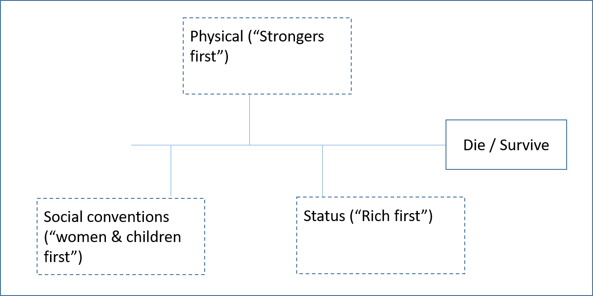

(from https://www.kaggle.com/competitions/titanic)

# I. WHAT IS THE CHALLENGE?

On April 15, 1912, during her maiden voyage, the widely considered “unsinkable” RMS Titanic sank after colliding with an iceberg. Unfortunately, there weren’t enough lifeboats for everyone onboard, resulting in:
- Death: 1502
- Total passengers and crew: 2224

It seems some groups of people were more likely to survive than others.

In this challenge, `we ask you to build a predictive model that answers the question: “what sorts of people were more likely to survive?”` using passenger data (ie name, age, gender, socio-economic class, etc). 

#### What Data Will I Use in This Competition?

In this competition, you’ll gain access to two similar datasets that include passenger information like name, `age, gender, socio-economic class, etc.` One dataset is titled `train.csv` and the other is titled `test.csv`.

- `train.csv` contain the details of a subset of the passengers on board (891 to be exact) and importantly, `will reveal whether they survived or not,` also known as the “ground truth”.

- `test.csv` contains similar information but `does not disclose` the “ground truth” for each passenger. `It’s your job to predict these outcomes.`

Using the patterns you find in the train.csv data, predict whether the other 418 passengers on board (found in test.csv) survived. 

# II. APPROACH:
The proposed problem is estimated as binary estimation: Survives (1) - Dies (0)

Before we open the dataset and start working on the available features, we will see the conditions necessary to survive in a catastrophic situation.
This can be used to determine the significance of the features available (or the features needed if we start from scratch without any dataset of features)

  

Now we can try to organize the features within this general scheme.
We can see:
- Note that being a woman and a girl can be a disadvantage compared to a grown man in a circumstance of jungle law, but on the contrary, it can be a great advantage to survive according to the rules of a civilized world.
- There are variables that a priori are estimated that do not determine survival in a disaster situation such as the name or ticket number.  We keep them under observation until they go through the analysis process. 

  

### 1. The Method <- Why?
Type of problem: Quantitative  
Model used: CRISP-DM (the standard of the industry)

1.1. Business understanding - What exactly is the problem we are trying to solve with data  
1.2. Data understanding - What exactly is in our data, such as what does each column mean and how does it relate to the business problem  
1.3. Data prep - Data preprocessing and preparation. This can also include feature engineering  
1.4. Modeling - Getting a model from our data (choosing a machine learning algorithm)  
1.5. Optimizing - Depending on the algorithm the machine learning model is using we can give it different parameters that can optimize the model for better performance  
- Evaluation: This tells you how well your model will perform on new data, or rather, data that it hasn't seen before. During training your model have good performance, but giving it new data may reveal that it actually is performing bad (metrics)
- Iterating: Iterating on the model is a part of the process that may not seem necessary, but it can be an important one. Your data may change over time which would then make your model stale. That is, it's relying on data that it used to but due to some process change or something similar it no longer does. And since the underlying data changed the model won't predict as well as it did.  
1.6. Deployment - Deploying the model for production use

### 2. The Technique <- Why?

### 3. The Tool(s) <- Why?

#### [(next step: Exploratory Data Analysis (EDA) ...)](https://github.com/akimwong/1_OnPremise/tree/main/Journey/002/03_Regression/01_Titanic/)

