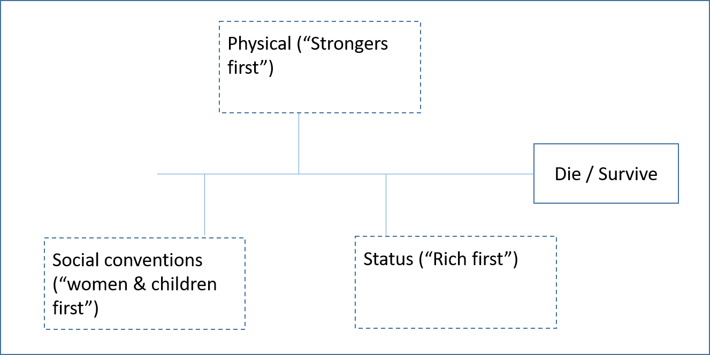
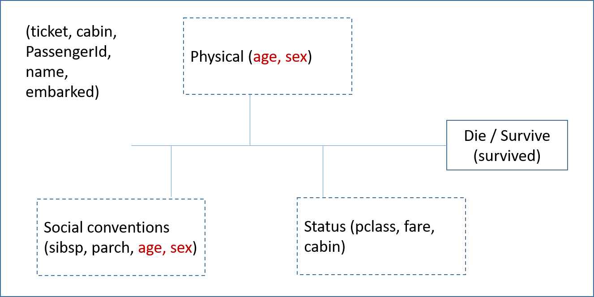

[(the datasets comes from...)](https://github.com/akimwong/1_OnPremise/tree/main/Journey/001/03_Regression/01_Titanic/)

## The Challenge:
Build a predictive model that answers the question: “what sorts of people were more likely to survive?”

## Approach:
The proposed problem is estimated as binary estimation: Survives (1) - Dies (0)

Before we open the dataset and start working on the available features, we will see the conditions necessary to survive in a catastrophic situation.
This can be used to determine the significance of the features available (or the features needed if we start from scratch without any dataset of features)

  

Now we can try to organize the features within this general scheme.
We can see:
- Note that being a woman and a girl can be a disadvantage compared to a grown man in a circumstance of jungle law, but on the contrary, it can be a great advantage to survive according to the rules of a civilized world.
- There are variables that a priori are estimated that do not determine survival in a disaster situation such as the name or ticket number.  We keep them under observation until they go through the analysis process. 

  

### 1. The Method <- Why?

### 2. The Technique <- Why?

### 3. The Tool(s) <- Why?

