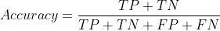
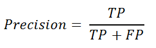
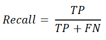
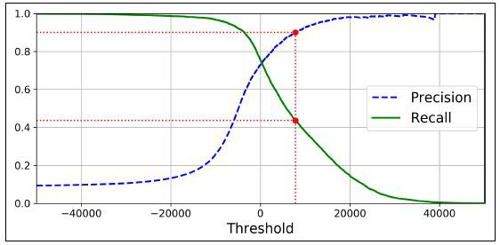
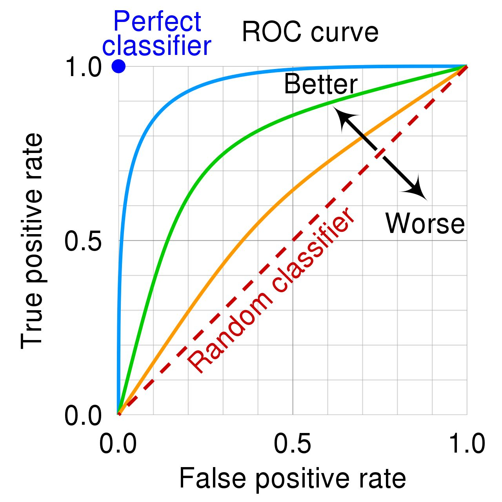

# Logistic Regression Explained in 7 Minutes
- Is a model that predicts the probability of an event taking place.
- It is used to solve classification problems, which means that the dependent variable is always a class or category
- Classification problems can be divided into two types: binary (involves predicting one of two classes) and multi-class classification (to predicting one of many classes)

### How Does Logistic Regression Work?
- Can be modeled with an S-shaped curve as displayed in the example below:

  

- The X-axis of this graph displays the number of years in the company, which is the dependent variable.  
- The Y-axis tells us the probability that a person will get promoted, and these values range from 0 to 1.  
- A probability of 0 indicates that the person will not get promoted and 1 tells us that they will get promoted.  
- Logistic regression returns an outcome of 0 (Promoted = No) for probabilities less than 0.5. A prediction of 1 (Promoted = Yes) is returned for probabilities greater than or equal to 0.5  

### How to Evaluate Logistic Regression Models?
- The most popular metric used to evaluate the performance of classification models is ACCURACY.
- However, accuracy ISN’T ALWAYS the most reliable indicator of a good model, which is why data scientists often use measures like PRECISION, RECALL, and the F1-SCORE instead.
- Using the dataset below that comprises information of whether a student passed an exam.
- The true data is imbalanced since 80% of students passed and 20% failed. 
- This means that the dataset is skewed to represent more of one class than another.

  

#### Accuracy

  

- This model has an 80% accuracy.
- Although its accuracy is high, the model has performed poorly.
- Accuracy can be a misleading metric in this case, since it can leave data scientists with the assumption that their model is good even when that is not the case.

#### Precision

  

- Precision is a measure that can tell us: out of all the positive predictions, how many students actually passed? In this case, the classifier’s precision is 0/0 = 0.

#### Recall

  

- A model’s recall can tell us: out of everyone who passed, how many of them were correctly identified? In this case, the classifier’s recall is 0/2 = 0.

#### F1-Score

  

- Combines the precision and recall value and gives us a single outcome
- his metric tells us how well a model is performing by taking the average of its precision and recall.  In this case, the classifier’s F1 score is 2 X 0= 0.

#### Summary
To summarize, this model’s accuracy is high but its precision, recall and F1-score are 0 because it did not make any positive predictions.  

While accuracy is often used to evaluate the performance of logistic regression models, it is important to calculate other measures as well to ensure that your model really is performing well.

# Classification Metrics Walkthrough: Logistic Regression with Accuracy, Precision, Recall, and ROC
- Classification is about predicting a label and then identifying which category an object belongs to based on different parameters.
- In order to measure how well our classification model is doing at making these predictions, we use classification metrics. 

#### Problems with the threshold
- Using the threshold concept of values above the threshold value tend to be 1, and a value below the threshold value tends to be 0 can cause challenges.
- Although there is the option to adjust the threshold value, it still raises the risk that we classify incorrectly.

#### 1. Accuracy
accuracy = correct_predictions / total_predictions

However, we can further expand on this using these:

    True Positive (TP) - you predicted positive and it’s actually positive 
    True Negative (TN) - you predicted negative and it’s actually negative
    False Positive (FP) - you predicted positive and it’s actually negative
    False Negative (FN) - you predicted negative and it’s actually positive  

So we can say the true predictions are TN+TP, while the false prediction is FP+FN. The equation can now be redefined as:

  

However, using the accuracy metric to measure the performance of your model is usually not enough. This is where we need other metrics.

#### Precision and Recall
If we want to further test the “accuracy” in different classes where we want to ensure that when the model predicts POSITIVE, it is in fact true positive - we use precision. We can also call this Positive Prediction Value which can be defined as:
 

  

If we want to further test the “accuracy” in different classes where we want to ensure that when the model predicts NEGATIVE, it actually is negative - we use recall. Recall is the same formula as sensitivity and can be defined as:

  

- Using both precision and recall are useful metrics when there is an imbalance in the observations between the two classes. 
- Raising the classification threshold reduces false positives - increasing precision. 
- Raising the classification threshold reduces true positives or keeps them the same, whilst increasing false negatives or keeps them the same. - decreasing recall or keeping it constant.
- Unfortunately, it’s not possible to have a high precision and recall value. If you increase precision, it will reduce recall - vice versa. This is known as the precision/recall tradeoff.

  

#### ROC Curve

Is a metric that we can use to lower both the FP and FN - it is called the Receiver Operating Characteristic curve, or ROC curve.

It plots the false positive rate (x-axis) against the true positive rate (y-axis).

    True Positive Rate = TP / (TP + FN)
    False Positive Rate = FP / (FP + TN) 

The true positive rate is also known as sensitivity, and the false positive rate is also known as the inverted specificity rate. 

    Specificity = TN / (TN + FP) 

If the values on the x-axis consist of smaller values, this indicates lower FP and higher TN. If the values on the y-axis consist of larger values, this indicates higher TP and lower FN.

The ROC presents the performance of a classification model at all classification thresholds, like this:

  

# Multiple Logistic Regression for Dichotomous Variables in R
- Simple logistic regression incorporates only one predictor variable
- When we incorporate another independent variable, the simple logistic regression become multiple logistic regression (the real world data has several predictor variables).
- Sometimes we simply don’t know if including the extra variable as a predictor will make the model more robust or not.
- We need to always compare the full model with the nested model and draw conclusion from the data.

