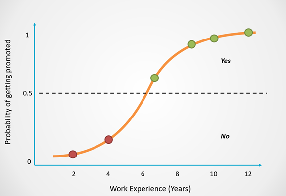
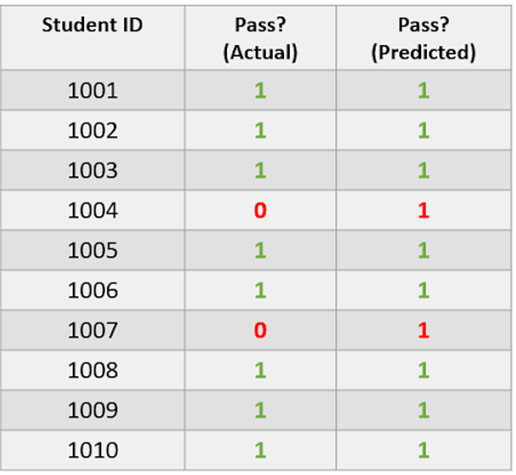
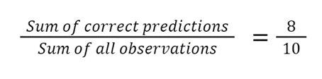
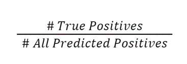
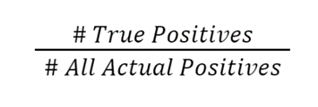
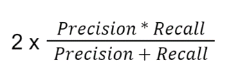

# Logistic Regression Explained in 7 Minutes
- Is a model that predicts the probability of an event taking place.
- It is used to solve classification problems, which means that the dependent variable is always a class or category
- Classification problems can be divided into two types: binary (involves predicting one of two classes) and multi-class classification (to predicting one of many classes)

### How Does Logistic Regression Work?
- Can be modeled with an S-shaped curve as displayed in the example below:

  

- The X-axis of this graph displays the number of years in the company, which is the dependent variable.  
- The Y-axis tells us the probability that a person will get promoted, and these values range from 0 to 1.  
- A probability of 0 indicates that the person will not get promoted and 1 tells us that they will get promoted.  
- Logistic regression returns an outcome of 0 (Promoted = No) for probabilities less than 0.5. A prediction of 1 (Promoted = Yes) is returned for probabilities greater than or equal to 0.5  

### How to Evaluate Logistic Regression Models?
- The most popular metric used to evaluate the performance of classification models is ACCURACY.
- However, accuracy ISN’T ALWAYS the most reliable indicator of a good model, which is why data scientists often use measures like PRECISION, RECALL, and the F1-SCORE instead.
- Using the dataset below that comprises information of whether a student passed an exam.
- The true data is imbalanced since 80% of students passed and 20% failed. 
- This means that the dataset is skewed to represent more of one class than another.

  

#### Accuracy

  

- This model has an 80% accuracy.
- Although its accuracy is high, the model has performed poorly.
- Accuracy can be a misleading metric in this case, since it can leave data scientists with the assumption that their model is good even when that is not the case.

#### Precision

  

- Precision is a measure that can tell us: out of all the positive predictions, how many students actually passed? In this case, the classifier’s precision is 0/0 = 0.

#### Recall

  

- A model’s recall can tell us: out of everyone who passed, how many of them were correctly identified? In this case, the classifier’s recall is 0/2 = 0.

#### F1-Score

  

- Combines the precision and recall value and gives us a single outcome
- his metric tells us how well a model is performing by taking the average of its precision and recall.  In this case, the classifier’s F1 score is 2 X 0= 0.

#### Summary
To summarize, this model’s accuracy is high but its precision, recall and F1-score are 0 because it did not make any positive predictions.

