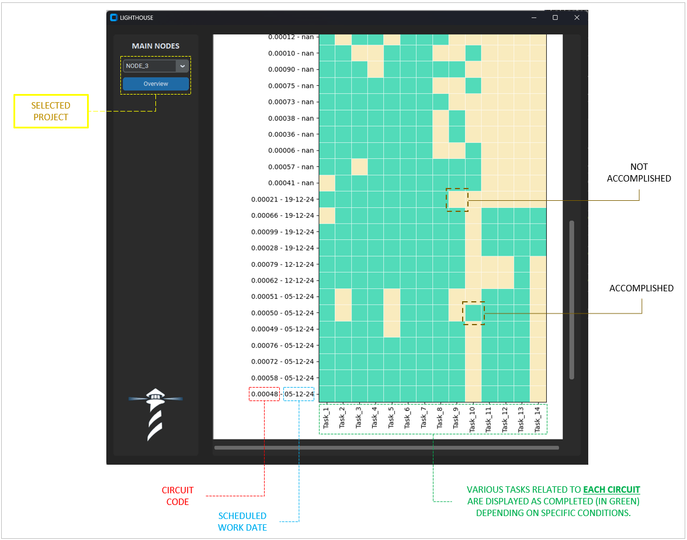

# Primary Nodes Visualization Dashboard

## Overview
An interactive **Python dashboard** for monitoring task completion status across multiple projects (NODE_1, NODE_2, etc.) from Excel files. Designed for project managers needing real-time visual analytics on task fulfillment conditions.

## **Key Features**

### **Dashboard Components**
1. **Dynamic Heatmap Visualization**
   - Color-coded task status (✅ green = complete, ⚠️ yellow = pending)
   - 14+ auto-detected completion conditions (dates, numeric values, text patterns)
   - Dual-axis labeling (tasks vs. project nodes)

2. **Multi-Project Analysis**
   - Supports simultaneous loading of multiple Excel files (`NODE_*.xlsx`)
   - Unified view of all task statuses across projects

3. **Data Processing Engine**
   - Automatic classification of tasks based on customizable rules
   - Smart date formatting and numeric validation
   - Error handling for missing/invalid data

4. **User Interface**
   - Modern dark-mode GUI built with `customtkinter`
   - Responsive scrollable canvas for large datasets
   - Intuitive project selector (combobox navigation)

---

## **Technical Specifications**

### **Technologies Used**
- **Primary Language**: Python 3.8+
- **Framework**: CustomTkinter (TKinter modernized)
- **Data Source**: Microsoft Excel (`.xlsx`)
- **Packaging**: PyInstaller (for executables)

### **Core Python Packages**
| Category         | Packages                          |
|------------------|-----------------------------------|
| GUI              | `customtkinter`, `Pillow`         |
| Data Processing  | `pandas`, `openpyxl`, `numpy`     |
| Visualization    | `matplotlib`                      |
| Utilities        | `sys`, `os`                       |

---

## **Screenshots**


## **Installation & Usage**

### **Requirements**
- Python 3.8+
- Recommended IDE: VSCode/PyCharm

### **Setup**
```bash
# Install dependencies
pip install customtkinter pandas matplotlib openpyxl Pillow

# Run application
python main.py
