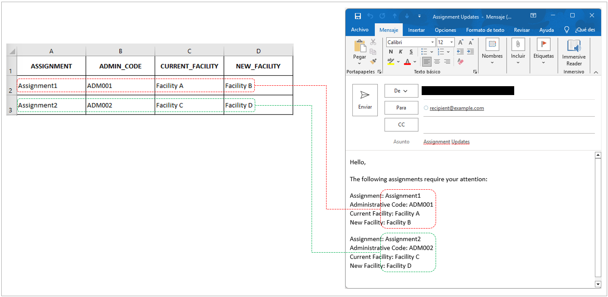

### Automated Email Generation

<b>Short name:</b> Email_merge 

<b>Role:</b> Data Automation Developer 

<b>Technologies:</b> R, Python, Excel 

<b>Tags:</b> Data Processing, Email Automation, Template Generation 

<b>Key Tools:</b> Jupyter Notebooks-R, RStudio, VStudio Code, Microsoft Excel 

<b>Description:</b> Developed parallel implementations in both Python and R for <b>generating personalized email templates based on structured data inputs.</b> The solution creates customized email content by merging template structures with individual recipient data, enabling efficient mass communication while maintaining personalization. The system includes manual verification steps to ensure content accuracy and appropriateness before actual email dispatch.

#### EXAMPLE:
<b>From excel to Email</b>
  

